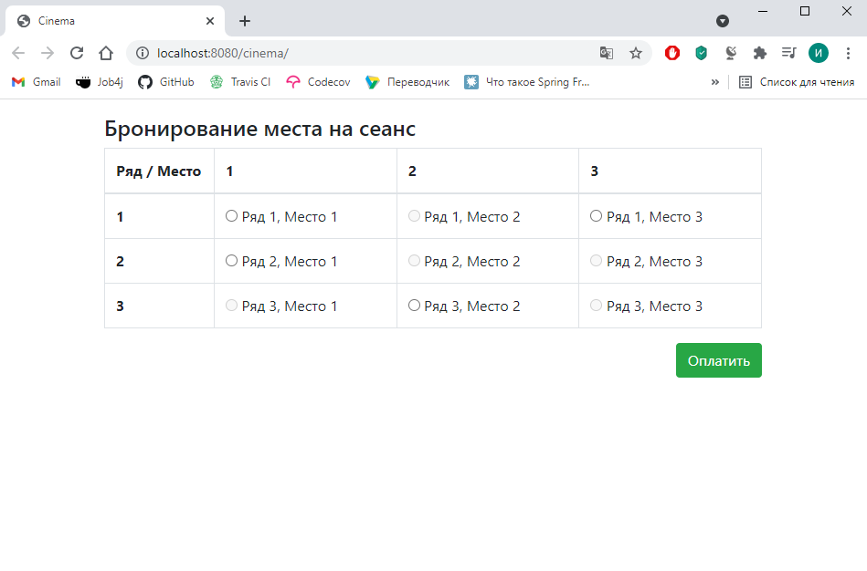

# job4j_cinema
Сервис бронирования билетов в кинотеатр.  
Архитектура Model-View-Controller.  
Сервис реализован с помощью servlet, страницы на JSP с обновлением данных о свободных белетах через ajax.
База данных postgres с JDBC.
Логирование при помощи SLF4J

Страница выбора билета:

Страница бронирования:

Сообщение о удачном бронировании:

Сообщение о неудачном бронировании:

